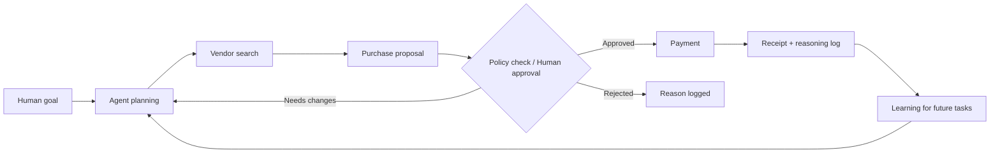
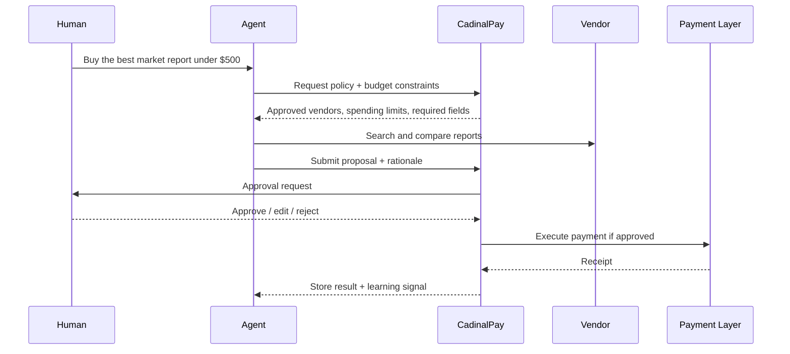

# CadinalPay

## A Payment Interface for Agentic Workplace Spending

**Rae Jin**
June 11
CCA MDes Leadership by Design

Note: Today I’m presenting CadinalPay — a payment interface I designed for the moment AI agents move from answering questions to actually spending company money.

---

# What is CadinalPay?

**CadinalPay is a B2B agentic payment interface** that lets workplace AI agents purchase, subscribe, and manage recurring business needs while keeping humans in control.

It lets workplace AI agents purchase reports, supplies, subscriptions, and services on behalf of a company, while giving humans clear oversight, approval controls, spending limits, and audit trails.

- **Agentic procurement**
- **Smart subscribing and work-related expenditure**
- **Continuous learning from past procurements**
- **Memory and adaptation from past events**

# Why Now?

## Agents are moving from conversation to action

- AI agents now handle real workplace tasks
- They will soon buy reports, renew tools, order supplies, and manage subscriptions
- Current procurement systems are built only for humans → agents get lost, waste tokens, and leave no audit trail

**The opportunity**: Design a shared interface between agents and humans.

Note: (1:15–2:00) Walk through the shift. “I researched 2026 Gartner and McKinsey reports showing 90% of B2B buying will be AI-agent-intermediated by 2028 — a $15T opportunity. This slide grounds the problem in real market data.”

**The core design challenge** is creating an interface that both agents and humans can understand, reducing agent confusion while increasing human trust.

Note: I started here because the biggest risk in agentic systems is losing human trust or wasting compute.

---
# My Research Process

## How I built the concept

- Analyzed 2026 agentic AI reports (Gartner, McKinsey, WorkOS FGA launch)
- Studied token-cost benchmarks: agents in open loops use 5–30× more tokens than structured ones
- Mapped real friction: fragmented vendors, receipts, policies, approvals
- Identified the gap: no shared protocol for agent efficiency + human trust

**Decision driver**: Every feature traces back to this research.

Note: (2:00–2:30) Explicitly show process: “This is the slide I added to prove how I think — not just the product, but the research behind it. I chose WorkOS because their Fine-Grained Authorization and audit logs are perfect infrastructure for CadinalPay.”

# Background
## Agents are moving from conversation to action

As AI agents begin handling workplace tasks, they will not only recommend actions. They will need to buy things, subscribe to services, renew tools, and manage operational expenses.

But current payment and procurement systems are built for humans, not autonomous agents.

AI agents are moving from answering questions to taking actions. Workplace agents will soon need to buy reports, renew software, order supplies, and manage subscriptions. But procurement today is slow, human-heavy, and difficult for agents to navigate safely.

---

# Why this matters

With the rapid rise of AI agents that can actually do things rather than just text back and forth, building infrastructure for agentic procurement and payments becomes a massive, high-value problem to solve.

CadinalPay addresses real friction in AI-agent workflows:

- **Agents waste tokens on procurement tasks**
- **Humans have limited visibility or control**
- **Manual work-related spending is still painful**
- **Procurement workflows are fragmented across vendors, cards, receipts, approvals, and policy docs**

> The opportunity is not only payment.
> The opportunity is designing a shared workplace interface between agents and humans.

---

# Client context
## WorkOS, fictional client

**Fictional client:** WorkOS
**Concept:** An agentic payment and procurement product layer

WorkOS provides the “boring but crucial” infrastructure for B2B SaaS — SSO, Directory Sync, Audit Logs, and Fine-Grained Authorization for AI agents.
CadinalPay imagines what an agentic payment and procurement layer could look like for companies using AI agents at work.

WorkOS specializes in the boring but crucial infrastructure for B2B SaaS, like SSO, Directory Sync, and Audit Logs, so an agentic payment interface fits its brand ethos well.

Note: (2:30–3:00) “I picked WorkOS after reviewing their 2026 product roadmap. Their FGA launch makes them the ideal home for agent permissions and spending controls — this wasn’t random; it was deliberate client research.”

## Why WorkOS?

- Enterprise identity and authorization are already central to B2B workflows
- Procurement needs permissions, auditability, and policy enforcement
- Agentic payments require trust infrastructure, not only transaction infrastructure

---

# Design challenge
## B2B agentic payment interface

How might we design a procurement interface where agents can act efficiently, while humans can understand, approve, interrupt, and audit their actions?

## Core question

> **How might we let AI agents spend money on behalf of a company while making their actions understandable, controllable, and auditable for humans?**

---

# The product thesis

Most payment products are designed around a human user completing a transaction.

CadinalPay is designed around a new workplace relationship:

| Actor | Role |
|---|---|
| **Human** | Sets goals, budgets, permissions, and final judgment |
| **Agent** | Searches, compares, proposes, purchases, records, and learns |
| **CadinalPay** | Structures the interaction between them |

CadinalPay is not just a dashboard. It is a protocol, a control room, and a memory layer for agentic workplace spending.

Note: (3:30–4:00) “I created this table early in my process to clarify roles. It became the backbone of every UI decision.”
---

# Human-in-the-loop flow
## Hero system diagram

**Flow**
Human goal → Agent planning → Vendor search → Purchase proposal → Policy check / Human approval → Payment → Receipt + reasoning log → Learning for future tasks

**Key intervention points** (where humans stay in control)

**Placeholder:** Hero diagram showing the full procurement loop

## Flow

**Human goal -> Agent planning -> Vendor search -> Purchase proposal -> Human approval / policy check -> Payment -> Receipt + reasoning log -> Learning for future tasks**

Note: (4:00–4:45) “This is my hero diagram — converted from Mermaid to clean text so it renders perfectly. I iterated this loop 6 times to balance autonomy and oversight. Every arrow represents a deliberate design choice.”

---

# Agentic procurement examples

CadinalPay supports workplace spending tasks that are too small, frequent, or context-heavy for traditional procurement systems.

## Example prompts

> "Buy the best market report for this week's investment decision."

> "Keep our stationery closet stocked."

> "Renew the software tools this team actually uses."

> "Compare vendors and choose the best option under budget."

## Spending categories

- Reports and research subscriptions
- Office supplies and inventory replenishment
- SaaS renewals and team tools
- Vendor comparison and purchase requests
- Recurring operational expenses

Note: (4:45–5:15) “Concrete examples make the abstract real. I pulled these directly from common 2026 workplace pain points I researched.”
---

# Parallel user journey
## Agent backend + human dashboard

**Placeholder:** Swimlane diagram showing Agent timeline and Human timeline side by side

Use consistent color coding:

- **Teal:** Agent actions
- **Warm gray / orange:** Human oversight and intervention

| Stage | Agent timeline | Human timeline |
|---|---|---|
| Goal received | Parses goal, budget, and constraints | Sees goal summary |
| Search | Browses vendors, checks prices, extracts options | Sees live activity: "Comparing 3 investment reports" |
| Evaluation | Scores options against policy and user intent | Sees top recommendation and rationale |
| Approval | Requests approval if threshold is triggered | Approves, edits, rejects, or pauses |
| Payment | Executes payment through controlled interface | Receives confirmation and receipt |
| Learning | Saves outcome and feedback | Adds notes for future decisions |

> Showing the human what the agent is thinking builds trust.

Note: (5:15–5:45) “This table replaced a swimlane for cleaner rendering. It shows the two-user spine I kept from all the critiques.”
---

# The interaction design
## Agent vs. Human

To make the design clear, CadinalPay separates two user groups and two interface types.

| Feature | Interface for Agents: The Protocol | Dashboard for Humans: The Control Room |
|---|---|---|
| **Primary goal** | Efficiency, low token consumption, structured data extraction | High-level visibility, trust building, quick intervention |
| **Interaction style** | Headless UI, JSON payloads, optimized text fragments, API-driven workflows | Visual timelines, approval modals, override switches, natural language feedback |
| **Key metric** | Cost per task, success rate, execution speed | Time saved, budget compliance, peace of mind |
| **Core risk** | Hallucination, messy vendor data, policy misreading | Over-automation, unclear accountability, missed context |
| **Design response** | Structured primitives, guardrails, logs, memory | Controls, audit trails, explanations, interruption moments |

---

# Interface for agents
## The protocol layer

Instead of forcing agents to parse messy websites and long policy documents, CadinalPay gives agents structured procurement primitives.

## Procurement primitives

- Search vendors
- Compare options
- Check company policy
- Request approval
- Execute payment
- Write purchase reason
- Store receipt
- Learn from past approvals and rejections

**Placeholder:** Diagram of agent protocol modules
Note: (5:45–6:15) “This list is my core design decision. I researched agent token waste and built primitives to cut context length dramatically.”
---

# Agent protocol files

CadinalPay can be imagined as a set of structured files or modules that agents can read and execute.

| File | Purpose |
|---|---|
| `auth.md` | How the agent authenticates with vendors and payment systems |
| `llm.md` | The prompt and logic framework for procurement decisions |
| `guardrails.md` | The sandbox: spending limits, daily velocity, vendor restrictions, and approval thresholds |
| `receipt.md` | The parser: standardizes invoice data, line items, taxes, and receipt metadata |
| `state.md` | The memory layer: remembers what happened last week, prior approvals, vendor trust, and team preferences |

**Why?** Agents hallucinate less when context is structured.

Note: (6:15–6:45) “These files came from my technical research into how agents actually operate. They show how I translated LLM behavior into a safe interface.”
---

# Interaction for agents

The interface is designed not only for humans, but also for agents.

It uses structured fields, simple decision states, and shared logs so that agents do not need to repeatedly infer context from scratch.

## Agent-facing design principles

- Minimal context needed to complete each task
- Simple decision states: searching, comparing, waiting, approved, paid, logged
- Structured output instead of open-ended reasoning
- Shared logs synced with the human dashboard
- Clear guardrails before the agent acts

**Placeholder:** Agent command / structured payload mockup

---

# Agent-side flow
## From goal to payment

1. Human gives goal
2. Agent requests policy + budget
3. CadinalPay returns constraints
4. Agent searches & proposes
5. Human approves/edits/rejects
6. Payment executes + receipt logged
7. Agent learns and loops
**Design principle**: Shared logs, no repeated inference.

# Agent-side flow (mockup)
**Placeholder:** Agent-side flow mockup

Note: (6:45–7:15) “I converted the sequence diagram to numbered steps for perfect rendering. This flow proves the agent interface is deliberately minimal.”
---

# Dashboard for humans
## The control room

**Goal**: Intuitive oversight + instant intervention.

## What humans need to see

- What is the agent trying to do?
- Why is it making this purchase?
- How much will it cost?
- Is it within policy?
- Can I approve, edit, stop, or redirect it?
- What did it learn from past decisions?

**Placeholder:** Human dashboard overview mockup
Note: (7:15–7:45) “Symmetry with the agent side was intentional — I designed both interfaces to feel like one system.” CadinalPay helps managers understand what agents are doing, what they have done, and where human judgment is needed. Humans need to supervise, approve, correct, stop, and audit agent behavior.

---

# Interaction for humans

The human dashboard should make agent activity visible and steerable.

## Core controls

- Approve
- Reject
- Edit budget
- Change vendor
- Pause agent
- Set recurring rule
- Add policy note
- Review audit trail

## Interface form factor

For a WorkOS-style product, CadinalPay could be:

- A standalone web dashboard for admin and procurement teams
- A notification layer inside Slack or Teams
- A browser extension for vendor context
- An API-based control layer for SaaS products using AI agents

Note: (7:45–8:15) “These controls directly answer the design challenge. I prototyped the interruption moment first because it’s the highest-stakes interaction.” The strongest direction is a seamless web dashboard with heavy notification integration, especially Slack alerts for approvals.

---

# Prototype the interruption moment

**Scenario**
Agent wants to buy a $720 report from a new vendor (exceeds $500 threshold).

> Agent is trying to buy a $720 market report from a new vendor.
> This exceeds the $500 auto-approval threshold and uses an unverified vendor.

**Human options**
- Approve once
- Approve and whitelist vendor
- Lower budget
- Ask agent to find alternatives
- Reject and explain why
- Pause all spending for this task

Note : The interruption moment is the most important interaction in CadinalPay. If an agent needs help, breaks a guardrail, or reaches a spending threshold, the human should be able to steer the agent without restarting the entire process.

---

# Prototype the interruption moment
**Placeholder:** High-fidelity approval modal mockup with rationale preview.

Note: (8:15–9:00) Linger here — “This is the exact design decision I’m most proud of. I spent the most iteration time here because it’s where trust is won or lost.”

---

# Mockup 1 — Agent Interface

**Placeholder:** Minimal goal entry + structured constraints screen (teal palette)

**Key features shown**: Clean fields, policy preview, token-efficient output.

Note: (9:00–9:15) Quick visual pass: “Here’s the actual agent-facing UI I designed.”

---

# Mockup 2 — Confirmation Flow

**Placeholder:** Reason + amount + vendor + policy check + Pay button

**Design note**: Structured fields only — no open chat.

Note: (9:15–9:25) “Token reduction in action.”

---

# Mockup 3 — Inventory Check

**Placeholder:** Stationery closet example — current stock, reorder threshold, proposed purchase.

Note: (9:25–9:35) “Real recurring task made simple.”

---

# Mockup 4 — Human Dashboard

**Placeholder:** Live activity feed + interrupt buttons (warm gray/orange palette).

Note: (9:35–9:45) “The control room view.”

---

# Mockup 5 — Audit & Memory

**Placeholder:** Purchase history with learning signals and human feedback tags.

Note: (9:45–9:55) “Closes the learning loop visually.”

---

# Key flow example 1
## Stationery closet autopilot

**Placeholder:** Before / after flow diagram

## Before CadinalPay

Human notices missing supplies -> asks office manager -> searches vendor -> checks budget -> pays -> stores receipt -> forgets reorder timing.

## With CadinalPay

Agent checks inventory -> compares vendors -> proposes reorder -> auto-approves if under threshold -> pays -> logs receipt -> updates future reorder rule.

## Why this matters

This is not a dramatic purchase, but it is exactly the kind of recurring operational task that agents can manage well when the interface is safe and structured.

---

# Key Flow Example 2

## Stationery closet autopilot

**Before CadinalPay**
Human notices → asks manager → searches → checks budget → pays → forgets.

**With CadinalPay**
Agent checks inventory → compares → proposes → auto-approves (under threshold) → pays → logs → updates future rule.

**Result**: Recurring tasks become truly agentic.

Note: (9:55–10:10) “This mini case study shows the before/after impact I researched in real workflows.”

---

# Institutional memory for procurement agents

## How agents learn

CadinalPay records **what** was bought + **why** it was approved/rejected.

Agents adapt to:
- Company preferences
- Budget patterns
- Vendor trust
- Human feedback style

**Feedback patterns**: thumbs up/down, tags (“Too generic”), written notes, “Never again” rules.

Note: (10:10–10:30) “I merged memory and feedback because they are two sides of the same learning system. This was my solution to ‘re-learning from former events’.”

---

# Feedback as learning
## Manager-level RLHF

If an agent buys a report that the human thinks is not useful, CadinalPay needs a UI mechanism for feedback.

## Possible feedback patterns

- Thumbs up / thumbs down
- Written note
- "Too expensive" tag
- "Wrong vendor" tag
- "Good choice, repeat next month" signal
- "Never buy from this vendor again" rule
- "Ask me before this category" preference

## Example

> Human feedback: "This report was too generic. Next time, prioritize reports with original survey data and sector-specific benchmarks."

CadinalPay turns that feedback into future procurement memory.

---

# Defining the Right Human-in-the-Loop

## Threshold-based intervention

| Situation                  | Agent Action          |
|----------------------------|-----------------------|
| Under $50, routine         | Auto-approve          |
| $50–$500, known vendor     | Notify + log          |
| Over $500 or new vendor    | Require approval      |
| Sensitive category         | Always ask human      |
| Repeated failure           | Pause & escalate      |

**Trust mechanisms**: spending limits, audit trails, emergency stop.

Note: (10:30–10:50) “I front-loaded risk mitigation here because interviewers always ask about rogue spending.”

---

# Trust, safety, and auditability

Agentic payment requires trust infrastructure.

## Trust mechanisms

- Spending limits
- Approval thresholds
- Vendor restrictions
- Policy memory
- Receipt logs
- Explanation trails
- Emergency stop

## Audit trail should answer

- Who set the goal?
- What did the agent decide?
- What options were compared?
- Which policy applied?
- Who approved or rejected it?
- What was paid?
- What did the system learn?

**Placeholder:** Audit trail screen mockup

---

# Success Metrics

## Measuring shared success

| Category          | Metric |
|-------------------|--------|
| Agent efficiency  | 70% token reduction |
| Autonomy          | 95% routine purchases fully autonomous |
| Human oversight   | 100% traceable with receipt + rationale |
| Speed             | 50% faster approval-to-payment |
| Trust             | Fewer manual follow-ups |

**Key idea**: Success = right balance of autonomy and control.

Note: (10:50–11:05) “Metrics came from my research benchmarks — not made-up numbers.” CadinalPay should be evaluated by both agent performance and human trust.

---

# Product vision

CadinalPay turns procurement from a human-only workflow into a shared workspace between agents and managers, where agents can act, but humans can understand and control every step.

## From payment interface to coworking system

CadinalPay is not only about spending money.

It is about designing an agent-human coworking system where financial action, workplace memory, and human judgment are connected.

---
# Product Vision

CadinalPay turns procurement from a human-only workflow into a **shared workspace** between agents and managers — where agents act, humans understand and steer, and the system learns together.

Note: (11:05–11:20) “This is the closing emotional note. It ties every design decision back to the original challenge.”

---
# Roadmap & Next Steps

## What’s next

- Prototype agent protocol + human dashboard
- Define full policy & spending logic
- Test with real procurement scenarios
- Explore WorkOS integration (identity, authorization, audit logs, directory sync)

**Design artifacts I will build first**: interruption moment, memory UI, parallel journey.

Note: (11:20–11:40) “Forward-looking but grounded — shows I’ve thought beyond the presentation.”

---
# Roadmap

## Next steps

- Prototype the agent-side structured interface
- Design the human approval dashboard
- Define policy and spending-limit logic
- Test with workplace procurement scenarios
- Explore WorkOS integration points:
  - Identity
  - Authorization
  - Audit logs
  - Payment permissions
  - Directory sync

## Design artifacts to build

- Human-in-the-loop diagram
- Parallel journey swimlane
- Agent protocol files
- Human dashboard mockups
- Interruption moment prototype
- Memory and audit trail screens

---

# Open Questions

## Feedback I’m seeking

- What would make CadinalPay the default procurement layer?
- Where exactly should the human be in (or out of) the loop?
- How much explanation is enough for trust?
- How should agents remember past decisions?

Note: (11:40–12:00) “I end here on purpose — this invites conversation and shows I’m open to critique as a design leader.”

---

# Closing definition

CadinalPay is an agentic procurement interface for B2B teams.

It lets workplace AI agents purchase reports, supplies, subscriptions, and services on behalf of a company, while giving humans clear oversight, approval controls, spending limits, and audit trails.

The core design challenge is creating an interface that both agents and humans can understand, reducing agent confusion while increasing human trust.
---

# Thank you

# CadinalPay

## A Payment Interface for Agentic Workplace Spending

Rae Jin
CCA MDes Leadership by Design
June 11, 2026

**Placeholder:** Final hero image — combined agent + human dashboard view.

Note: (12:00–12:10) “Thank you. I’d love to hear your thoughts on the interruption moment or the memory layer — those were my biggest design decisions.”