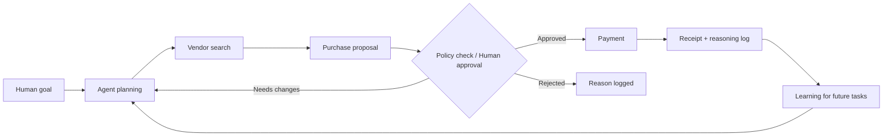
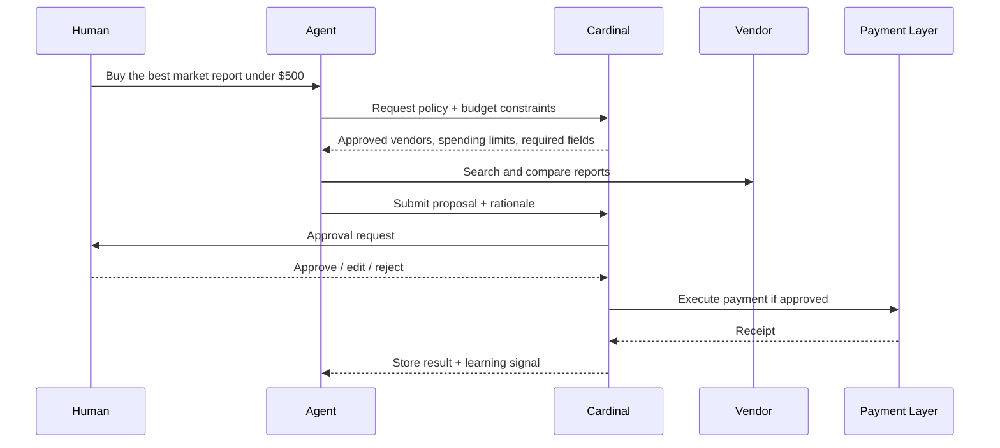

# Cardinal

## A Payment Interface for Agentic Workplace Spending

**Rae Jin**  
June 11  
CCA MDes Leadership by Design

Note: Open with Cardinal as a speculative B2B product for the near future of workplace AI agents.

---

# What is Cardinal?

**Cardinal is a B2B agentic payment interface that lets workplace AI agents purchase, subscribe, and manage recurring business needs while keeping humans in control.**

Cardinal is an agentic procurement interface for B2B teams. It lets workplace AI agents purchase reports, supplies, subscriptions, and services on behalf of a company, while giving humans clear oversight, approval controls, spending limits, and audit trails.

The core design challenge is creating an interface that both agents and humans can understand, reducing agent confusion while increasing human trust.

## Core features

- **Agentic procurement**
- **Smart subscribing and work-related expenditure**
- **Continuous learning from past procurements**
- **Memory and adaptation from past events**

---

# Background
## Agents are moving from conversation to action

As AI agents begin handling workplace tasks, they will not only recommend actions. They will need to buy things, subscribe to services, renew tools, and manage operational expenses.

But current payment and procurement systems are built for humans, not autonomous agents.

AI agents are moving from answering questions to taking actions. Workplace agents will soon need to buy reports, renew software, order supplies, and manage subscriptions. But procurement today is slow, human-heavy, and difficult for agents to navigate safely.

---

# Why this matters

With the rapid rise of AI agents that can actually do things rather than just text back and forth, building infrastructure for agentic procurement and payments becomes a massive, high-value problem to solve.

Cardinal addresses real friction in AI-agent workflows:

- **Agents waste tokens on procurement tasks**
- **Humans have limited visibility or control**
- **Manual work-related spending is still painful**
- **Procurement workflows are fragmented across vendors, cards, receipts, approvals, and policy docs**

> The opportunity is not only payment.  
> The opportunity is designing a shared workplace interface between agents and humans.

---

# Client context
## WorkOS, fictional client

**Fictional client:** WorkOS  
**Concept:** An agentic payment and procurement product layer

WorkOS provides infrastructure for modern B2B software. Cardinal imagines what an agentic payment and procurement layer could look like for companies using AI agents at work.

WorkOS specializes in the boring but crucial infrastructure for B2B SaaS, like SSO, Directory Sync, and Audit Logs, so an agentic payment interface fits its brand ethos well.

## Why WorkOS?

- Enterprise identity and authorization are already central to B2B workflows
- Procurement needs permissions, auditability, and policy enforcement
- Agentic payments require trust infrastructure, not only transaction infrastructure

---

# Design challenge
## B2B agentic payment interface

How might we design a procurement interface where agents can act efficiently, while humans can understand, approve, interrupt, and audit their actions?

## Core question

> **How might we let AI agents spend money on behalf of a company while making their actions understandable, controllable, and auditable for humans?**

---

# The product thesis

Most payment products are designed around a human user completing a transaction.

Cardinal is designed around a new workplace relationship:

| Actor | Role |
|---|---|
| **Human** | Sets goals, budgets, permissions, and final judgment |
| **Agent** | Searches, compares, proposes, purchases, records, and learns |
| **Cardinal** | Structures the interaction between them |

Cardinal is not just a dashboard. It is a protocol, a control room, and a memory layer for agentic workplace spending.

---

# Human-in-the-loop flow
## Hero system diagram

**Placeholder:** Hero diagram showing the full procurement loop

## Flow

**Human goal -> Agent planning -> Vendor search -> Purchase proposal -> Human approval / policy check -> Payment -> Receipt + reasoning log -> Learning for future tasks**

---

# Agentic procurement examples

Cardinal supports workplace spending tasks that are too small, frequent, or context-heavy for traditional procurement systems.

## Example prompts

> "Buy the best market report for this week's investment decision."

> "Keep our stationery closet stocked."

> "Renew the software tools this team actually uses."

> "Compare vendors and choose the best option under budget."

## Spending categories

- Reports and research subscriptions
- Office supplies and inventory replenishment
- SaaS renewals and team tools
- Vendor comparison and purchase requests
- Recurring operational expenses

---

# Parallel user journey
## Agent backend + human dashboard

**Placeholder:** Swimlane diagram showing Agent timeline and Human timeline side by side

Use consistent color coding:

- **Teal:** Agent actions
- **Warm gray / orange:** Human oversight and intervention

| Stage | Agent timeline | Human timeline |
|---|---|---|
| Goal received | Parses goal, budget, and constraints | Sees goal summary |
| Search | Browses vendors, checks prices, extracts options | Sees live activity: "Comparing 3 investment reports" |
| Evaluation | Scores options against policy and user intent | Sees top recommendation and rationale |
| Approval | Requests approval if threshold is triggered | Approves, edits, rejects, or pauses |
| Payment | Executes payment through controlled interface | Receives confirmation and receipt |
| Learning | Saves outcome and feedback | Adds notes for future decisions |

> Showing the human what the agent is thinking builds trust.

---

# The interaction design
## Agent vs. Human

To make the design clear, Cardinal separates two user groups and two interface types.

| Feature | Interface for Agents: The Protocol | Dashboard for Humans: The Control Room |
|---|---|---|
| **Primary goal** | Efficiency, low token consumption, structured data extraction | High-level visibility, trust building, quick intervention |
| **Interaction style** | Headless UI, JSON payloads, optimized text fragments, API-driven workflows | Visual timelines, approval modals, override switches, natural language feedback |
| **Key metric** | Cost per task, success rate, execution speed | Time saved, budget compliance, peace of mind |
| **Core risk** | Hallucination, messy vendor data, policy misreading | Over-automation, unclear accountability, missed context |
| **Design response** | Structured primitives, guardrails, logs, memory | Controls, audit trails, explanations, interruption moments |

---

# Interface for agents
## The protocol layer

Instead of forcing agents to parse messy websites and long policy documents, Cardinal gives agents structured procurement primitives.

## Procurement primitives

- Search vendors
- Compare options
- Check company policy
- Request approval
- Execute payment
- Write purchase reason
- Store receipt
- Learn from past approvals and rejections

**Placeholder:** Diagram of agent protocol modules

---

# Agent protocol files

Cardinal can be imagined as a set of structured files or modules that agents can read and execute.

| File | Purpose |
|---|---|
| `auth.md` | How the agent authenticates with vendors and payment systems |
| `llm.md` | The prompt and logic framework for procurement decisions |
| `guardrails.md` | The sandbox: spending limits, daily velocity, vendor restrictions, and approval thresholds |
| `receipt.md` | The parser: standardizes invoice data, line items, taxes, and receipt metadata |
| `state.md` | The memory layer: remembers what happened last week, prior approvals, vendor trust, and team preferences |

## Why this matters

Agents fail. They hallucinate. They misread messy PDFs and vendor pages. Cardinal reduces ambiguity by giving agents a structured action environment.

---

# Interaction for agents

The interface is designed not only for humans, but also for agents.

It uses structured fields, simple decision states, and shared logs so that agents do not need to repeatedly infer context from scratch.

## Agent-facing design principles

- Minimal context needed to complete each task
- Simple decision states: searching, comparing, waiting, approved, paid, logged
- Structured output instead of open-ended reasoning
- Shared logs synced with the human dashboard
- Clear guardrails before the agent acts

**Placeholder:** Agent command / structured payload mockup

---

# Agent-side flow
## From goal to payment

**Placeholder:** Agent-side flow mockup

---

# Dashboard for humans
## The control room

**Goal:** intuitive oversight, interruption, and control.

Cardinal helps managers understand what agents are doing, what they have done, and where human judgment is needed.

Humans need to supervise, approve, correct, stop, and audit agent behavior.

## What humans need to see

- What is the agent trying to do?
- Why is it making this purchase?
- How much will it cost?
- Is it within policy?
- Can I approve, edit, stop, or redirect it?
- What did it learn from past decisions?

**Placeholder:** Human dashboard overview mockup

---

# Interaction for humans

The human dashboard should make agent activity visible and steerable.

## Core controls

- Approve
- Reject
- Edit budget
- Change vendor
- Pause agent
- Set recurring rule
- Add policy note
- Review audit trail

## Interface form factor

For a WorkOS-style product, Cardinal could be:

- A standalone web dashboard for admin and procurement teams
- A notification layer inside Slack or Teams
- A browser extension for vendor context
- An API-based control layer for SaaS products using AI agents

The strongest direction is a seamless web dashboard with heavy notification integration, especially Slack alerts for approvals.

---

# Prototype the interruption moment

The interruption moment is the most important interaction in Cardinal.

If an agent needs help, breaks a guardrail, or reaches a spending threshold, the human should be able to steer the agent without restarting the entire process.

## Prototype this exact moment

**Placeholder:** Notification / approval modal mockup

**Example:**

> Agent is trying to buy a $720 market report from a new vendor.  
> This exceeds the $500 auto-approval threshold and uses an unverified vendor.

Human options:

- Approve once
- Approve and whitelist vendor
- Lower budget
- Ask agent to find alternatives
- Reject and explain why
- Pause all spending for this task

---

# Mockup set
## Recommended high-fidelity screens

**Placeholder:** 4-5 screen mockup grid

The deck should include at least 4-5 high-fidelity screens.

## Suggested screens

1. **Agent chat / command interface**  
   Minimal goal entry and structured constraints.

2. **Confirmation flow**  
   Reason, amount, vendor, policy check, and Pay button.

3. **Inventory check**  
   Stationery closet example: current stock, reorder threshold, proposed purchase.

4. **Human dashboard**  
   Live agent activity feed, current tasks, interrupt buttons.

5. **Audit and memory screen**  
   What was purchased, why, who approved it, and what the agent learned.

---

# Key flow example
## Stationery closet autopilot

**Placeholder:** Before / after flow diagram

## Before Cardinal

Human notices missing supplies -> asks office manager -> searches vendor -> checks budget -> pays -> stores receipt -> forgets reorder timing.

## With Cardinal

Agent checks inventory -> compares vendors -> proposes reorder -> auto-approves if under threshold -> pays -> logs receipt -> updates future reorder rule.

## Why this matters

This is not a dramatic purchase, but it is exactly the kind of recurring operational task that agents can manage well when the interface is safe and structured.

---

# Institutional memory for procurement agents

Cardinal records not only what was purchased, but why it was approved or rejected.

Over time, agents learn:

- Company preferences
- Budget patterns
- Vendor trust
- Approval logic
- Recurring needs
- Human feedback style

## The memory question

How does "continuous learning from past procurements" actually look in the interface?

**Placeholder:** Memory card / learning feedback UI

---

# Feedback as learning
## Manager-level RLHF

If an agent buys a report that the human thinks is not useful, Cardinal needs a UI mechanism for feedback.

## Possible feedback patterns

- Thumbs up / thumbs down
- Written note
- "Too expensive" tag
- "Wrong vendor" tag
- "Good choice, repeat next month" signal
- "Never buy from this vendor again" rule
- "Ask me before this category" preference

## Example

> Human feedback: "This report was too generic. Next time, prioritize reports with original survey data and sector-specific benchmarks."

Cardinal turns that feedback into future procurement memory.

---

# The human-in-the-loop friction

If an agent has to stop and ask a human for permission too often, the value of the agent drops.

If it never asks, the company risks rogue spending, policy violations, or low-quality purchases.

Cardinal needs to clearly define thresholds for intervention.

## Example intervention logic

| Situation | Agent action |
|---|---|
| Under $50, approved vendor, routine category | Auto-approve |
| $50-$500, known vendor, normal category | Notify and log |
| Over $500 | Ask for approval |
| New vendor | Ask for approval |
| Sensitive category | Require approval |
| Repeated failure or unclear data | Pause and ask human |

---

# Trust, safety, and auditability

Agentic payment requires trust infrastructure.

## Trust mechanisms

- Spending limits
- Approval thresholds
- Vendor restrictions
- Policy memory
- Receipt logs
- Explanation trails
- Emergency stop

## Audit trail should answer

- Who set the goal?
- What did the agent decide?
- What options were compared?
- Which policy applied?
- Who approved or rejected it?
- What was paid?
- What did the system learn?

**Placeholder:** Audit trail screen mockup

---

# Success metrics

Cardinal should be evaluated by both agent performance and human trust.

## Example metrics

| Category | Metric |
|---|---|
| Agent efficiency | 70% token reduction for routine procurement tasks |
| Autonomy | 95% of routine purchases fully autonomous under policy |
| Human oversight | 100% of payments traceable with explanation and receipt |
| Speed | 50% faster approval-to-payment workflow |
| Trust | Reduced manual follow-up and fewer unclear purchases |
| Budget control | Fewer out-of-policy purchases |

## Key idea

Success is not full automation.  
Success is the right balance between autonomy and control.

---

# Product vision

Cardinal turns procurement from a human-only workflow into a shared workspace between agents and managers, where agents can act, but humans can understand and control every step.

## From payment interface to coworking system

Cardinal is not only about spending money.

It is about designing an agent-human coworking system where financial action, workplace memory, and human judgment are connected.

---

# Roadmap

## Next steps

- Prototype the agent-side structured interface
- Design the human approval dashboard
- Define policy and spending-limit logic
- Test with workplace procurement scenarios
- Explore WorkOS integration points:
  - Identity
  - Authorization
  - Audit logs
  - Payment permissions
  - Directory sync

## Design artifacts to build

- Human-in-the-loop diagram
- Parallel journey swimlane
- Agent protocol files
- Human dashboard mockups
- Interruption moment prototype
- Memory and audit trail screens

---

# Open questions
## Feedback I am looking for

> **What would make Cardinal the default procurement layer for every agentic platform?**

## Design questions

- What should be considered when designing an agent-human coworking system?
- Where should the human be in the loop, and where should they be out of the loop?
- What level of explanation is enough for trust?
- How should agents remember past procurement decisions?
- What should be controlled by policy, and what should be controlled by human judgment?

---

# Closing definition

Cardinal is an agentic procurement interface for B2B teams.

It lets workplace AI agents purchase reports, supplies, subscriptions, and services on behalf of a company, while giving humans clear oversight, approval controls, spending limits, and audit trails.

The core design challenge is creating an interface that both agents and humans can understand, reducing agent confusion while increasing human trust.

---

# Thank you

## Cardinal
### A Payment Interface for Agentic Workplace Spending

Rae Jin  
CCA MDes Leadership by Design

**Placeholder:** Final product hero image or dashboard mockup
